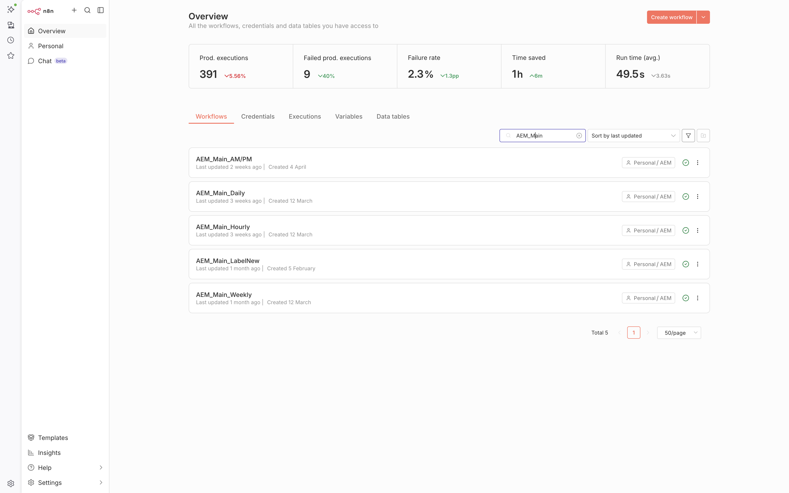
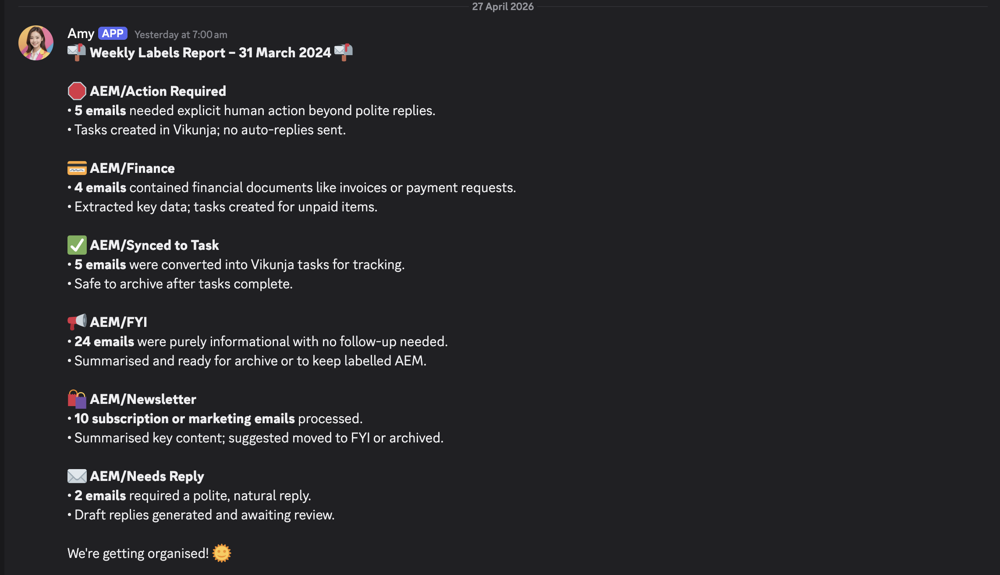
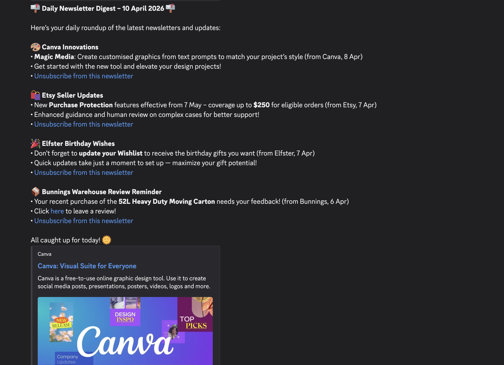
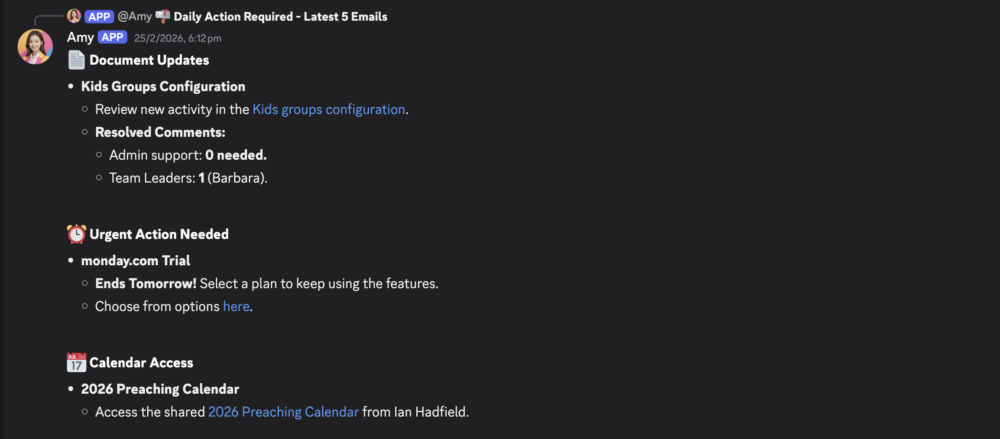
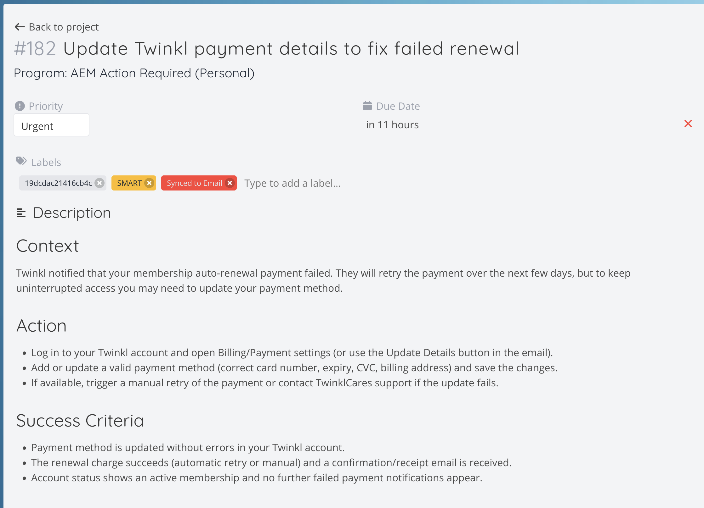

# Automatic Email Manager (AEM)

**Intelligent n8n-powered inbox automation that classifies emails, extracts actionable tasks, generates style-consistent drafts, and delivers daily digests — turning hours of manual triage into structured productivity.**

## About

AEM is a robust, self-hosted automation system built in **n8n** that intelligently manages high-volume Gmail inboxes. It combines rule-based logic, defensive JavaScript Code nodes, and OpenAI agents to classify emails, surface action items, convert them into structured Vikunja tasks, route summaries to Discord, and support context-aware reply drafting.

Designed and implemented by a Site Pastor managing complex ministry, family, and operational responsibilities, AEM demonstrates production-grade automation architecture that solves real-world overload while maintaining full user control and security.

### Business Value Delivered
- **8–12 hours saved per week** on manual email triage
- Dramatically reduced response fatigue and missed follow-ups
- Consistent, high-quality task extraction with SMART criteria
- Scalable foundation for multi-account and advanced AI workflows

**Target Audience**: Busy professionals, pastors, and small-team operators who need reliable, private automation without SaaS lock-in.

## Key Features

- **Hierarchical AI Classification** — Multi-label system (AEM/Action Required → Needs Reply, Newsletter, Meeting, Finance, FYI) with Eisenhower + domain MVV prioritisation
- **Actionable Task Extraction** — Full thread summarisation → SMART Vikunja tasks with HTML descriptions and approval workflows
- **Daily Discord Digests** — Length-controlled summaries with emojis, links, and clean formatting
- **Smart Unsubscribe & Archiving** — RFC 2047 decoding, one-click List-Unsubscribe, and `ready_to_archive` logic
- **Defensive Engineering** — Robust JSON repair, label diffing, batch processing, and error-resilient data handoff
- **Style-Consistent Drafting** — Ready for OpenAI generation in Christ-centred, professional pastoral tone (core loop operational)

## Tech Stack

- **Core**: n8n (main workflows + advanced Code nodes)
- **AI**: OpenAI Chat Completions (gpt-4o-mini and equivalents)
- **Integrations**: Gmail API, Vikunja, Discord, Google Drive/Calendar
- **Infrastructure**: Docker + Docker Compose, self-hosted VPS (Ubuntu)
- **Prompt Engineering**: Markdown-based living prompts and reusable logic

## Screenshots & Demo

*End-to-end Gmail → Classification → Task → Digest flow*

*Simple daily summaries of emails sorted and processed*

*Clean, scannable daily summaries of News and FYI emails*

*Clean, scannable daily summaries of action emails*

*AI-generated tasks with full context*

## Installation (Self-Hosted)

### Prerequisites
- Ubuntu 24.04 VPS (or equivalent)
- Docker & Docker Compose
- n8n license (or community edition)
- API keys: OpenAI, Gmail (OAuth), Vikunja, Discord